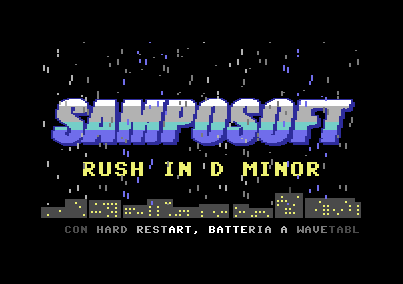
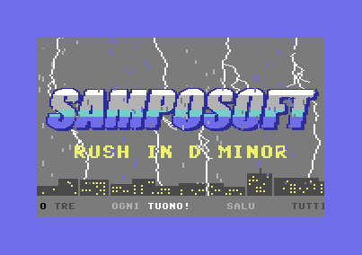

# RUSH

Intro per Commodore 64 in assembler 6502: logo SAMPOSOFT su una città
notturna, fulmini sincronizzati con la musica, lampi che illuminano il cielo
e fanno tremare lo schermo, pioggia di sprite e scroller. La musica è
"Rush in D minor", un brano a tre voci in stile videogioco.





## Avvio

```bash
./target/release/c64 demo/intro_rush/intro_rush.prg
```

L'emulatore scrive `RUN` dopo l'avvio. Il PRG (17 KB, da `$0801`) gira anche su
un C64 vero o in VICE (`x64sc -autostart intro_rush.prg`). Non si esce: serve
un reset.

## Cosa fa

- **Grafica**: bitmap multicolor 160×200. Ogni cella ha tre colori propri più
  lo sfondo, e ciascuno ha un ruolo:

  | Bit | Colore da | Uso |
  |---|---|---|
  | `00` | `$D021` | cielo (cambia con i lampi) |
  | `01` | nibble alto dello schermo | riempimento del logo, titolo, finestre, stelle |
  | `10` | nibble basso dello schermo | contorno e ombra del logo, palazzi |
  | `11` | color RAM | fulmini |

- **Logo**: "SAMPOSOFT" in corsivo, righe di celle 7-12, sfumato dal bianco al
  grigio, ciano e azzurro, con contorno e ombra blu. Un riflesso bianco lo
  attraversa da sinistra a destra: si cambia il nibble alto dello schermo di
  due colonne alla volta e si ripristina quella lasciata indietro.
- **Titolo**: "RUSH IN D MINOR" con il font del C64 a doppia larghezza e
  altezza, righe 15-16.
- **Fulmini**: quattro, uno per corsia di 10 colonne, frastagliati e con rami.
  I loro pixel usano il colore `11`, quindi restano invisibili finché la color
  RAM delle loro celle (25-34 per fulmine) è nera. Ogni fulmine ha una routine
  di sole `STA $D8xx`: accenderlo costa 4 cicli per cella. Quando scocca
  diventa bianco, tremola, torna bianco e sfuma nell'azzurro e nel blu fino a
  sparire.
- **Lampo**: sui colpi forti lo sfondo passa per il grigio e i palazzi
  appaiono in controluce, mentre lo schermo trema per 12 frame con lo scroll
  fine orizzontale e verticale.
- **Sincronia**: una tabella ha un byte per ogni riga delle 20 battute del
  brano (bit 0-3 = fulmini, bit 4 = lampo e tremolio). Un fulmine per
  battuta, due nella seconda sezione, una cascata sulle rullate e tutti
  insieme all'ingresso delle sezioni e prima della ripetizione. Gli effetti
  partono 2 frame dopo la lettura della riga, quando la nota esce davvero
  dopo l'hard restart.
- **Pioggia**: 8 sprite espansi (48×42 pixel) riusati su 4 fasce, per 32
  sprite a schermo, con tre forme alternate tra le fasce. Le gocce cadono di 4
  linee per frame: ogni frame i dati delle tre forme ruotano di due righe
  verso il basso, senza spostare gli sprite.
- **Scroller**: riga 23 in modo testo a 40 colonne, 2 pixel per frame, con una
  sfumatura dal bianco al grigio scuro verso i lati. La colonna 0 ha colore
  nero, così le lettere spariscono nello sfondo senza scatti.
- **Musica**: Re minore, 150 BPM, 20 battute (intro di 4, prima sezione di 8,
  seconda di 8), poi ricomincia.
  - voce 1: melodia a onda quadra con modulazione dell'ampiezza d'impulso e
    vibrato che parte dopo 12 frame;
  - voce 2: basso a dente di sega nel filtro passa-basso risonante, che si
    chiude su ogni nota, alternato a cassa e rullante;
  - voce 3: accordi arpeggiati a ogni frame.

  Ogni nota tiene il gate chiuso per 2 frame (hard restart), così l'attacco
  riparte sempre da zero. Cassa e rullante fanno lampeggiare il bordo.

## Interrupt raster

KERNAL e BASIC restano accesi: gli interrupt passano per il vettore `$0314`
ed escono da `$EA81`. Gli interrupt del CIA sono spenti. Cinque interrupt per
frame:

| Riga raster | Cosa fa |
|---|---|
| 252 | torna in bitmap multicolor (con il tremolio se attivo), sprite sulla fascia 1 della pioggia, poi musica, fulmini, lampo, riflesso, scroller e rotazione della pioggia |
| 59, 101, 143 | sprite sulle fasce 2, 3 e 4 (Y 87, 129, 171), a metà della fascia precedente |
| 232 | passa al modo testo per lo scroller, dentro la riga 22 che è vuota: il cambio di modo non si vede |

L'interrupt della riga 252 imposta subito il successivo, poi fa il lavoro
lungo e finisce verso la riga 300, molto prima della riga 59 del frame dopo.
Nelle righe 22-24 lo schermo contiene spazi e testo, non colori della bitmap.

## Memoria

| Indirizzo | Contenuto |
|---|---|
| `$0801` | stub BASIC `2026 SYS2061` |
| `$080D`-`$1A6D` | codice, player, musica, variabili e testo dello scroller |
| `$0400` | colori della bitmap (righe 0-21), testo dello scroller (righe 22-24), puntatori degli sprite |
| `$2000`-`$3F3F` | bitmap |
| `$3F40`-`$3FFF` | tre forme della pioggia (blocchi sprite 253-255) |
| `$4000`-`$47CF` | colori iniziali di schermo e color RAM, copiati all'avvio |
| `$47D0`-`$4AAB` | routine dei fulmini e tabella degli effetti |
| `$02`-`$04`, `$FB`-`$FE` | zero page: temporanei e puntatore allo scroller |

Le forme della pioggia stanno subito dopo la bitmap perché nel banco 0 il VIC
vede la ROM dei caratteri a `$1000`-`$1FFF`. `$3FFF` resta a zero: è anche il
byte che il VIC mostra in stato idle.
