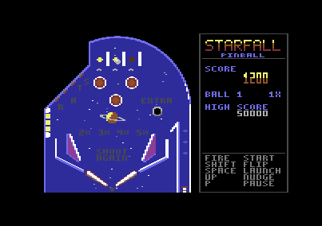
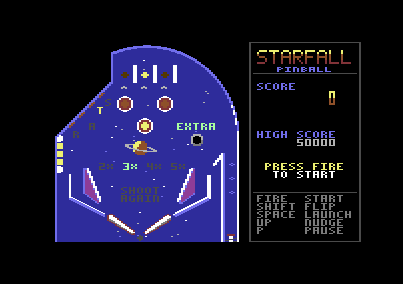

# STARFALL

A pinball table for the Commodore 64, in 6502 assembler: one screen, a
multicolour bitmap table with lamps, sprite flippers and ball, and a physics
engine in fixed point that lets the ball roll along curves, rest in the
cradle of a raised flipper and fly off a flipper hit at its tip. Three
balls, bonus multiplier, skill shot, ball save, extra ball, tilt, sound
effects and a tune in attract mode.





## Running

```bash
cd demo/pinball
python3 gen_data.py                       # data.asm, init.asm, consts.asm (numpy, Pillow)
64tass -C -o pinball.prg --labels=pinball.lbl pinball.asm
../../target/release/c64 pinball.prg
```

The generated files are in the repository, so `64tass` alone rebuilds the
PRG. The PRG loads at `$0801` (39 KB, up to `$A30F`) and starts with `RUN`;
it also runs in VICE (`x64sc -autostart pinball.prg`).

## Controls

| | Joystick (port 2) | Keyboard |
|---|---|---|
| left flipper | left | left SHIFT or Z |
| right flipper | right | right SHIFT or / |
| both flippers | fire | SPACE |
| plunger (hold, then release) | down, or fire while the ball is on it | SPACE or RETURN |
| nudge | up | N |
| start | fire | SPACE or F1 |
| pause | | P |

In the emulator the arrows are joystick 2 and SPACE is both SPACE and fire.
The longer the plunger is held (up to about 0.7 s), the stronger the
launch: a weak one falls back onto the plunger, a full one runs round the
whole arch and drops into the top lanes.

## Rules

| Target | Points | Also |
|---|---|---|
| pop bumper | 100 | its cap flashes |
| slingshot | 10 | |
| top lane | 500 (100 if already lit) | +1 bonus; the three lit raise the multiplier (2X to 5X) and score 2,500 |
| S-T-A-R stand-up target | 250 (50 if already lit) | +1 bonus; all four: STAR BONUS, 10,000 and +5 bonus |
| drop target | 500 | +1 bonus; all three: 5,000 and EXTRA BALL lights at the saucer; the bank comes back up |
| saucer | 1,000 | +1 bonus; with EXTRA BALL lit, an extra ball (SHOOT AGAIN) |
| inlane | 500 | +1 bonus |
| outlane | 2,500 | |
| skill shot | 5,000 | the first top lane after the launch is the blinking one |

- **Lane change**: a flipper press moves the lit top lanes one place left
  or right.
- **Bonus**: 1,000 per bonus unit, times the multiplier, counted at the end
  of the ball. The multiplier goes back to 1X with every new ball.
- **Ball save**: for 8 seconds after the ball leaves the plunger lane
  (the lamp between the flippers blinks) a lost ball comes back, once.
- **Nudge and tilt**: a nudge pushes the ball up and a little sideways.
  Two quick nudges show DANGER, a third one TILT: flippers dead, lamps off,
  no points and no bonus for that ball.
- A ball that stays still for 4 seconds away from the flippers gets a push.
- The high score (50,000 at start) stays until the machine is switched off.

## How it works

### Table

`table.py` describes the table with shapes that have a signed distance
function (negative inside): circles, capsules, polygons with rounded
corners, and "outside", everything beyond the arch and the side walls.
Every shape has a material: plain wall, rubber (bouncier), or special
(bumpers, slingshot faces, stand-up targets). `gen_data.py` makes both the
picture and the collision maps from these shapes, so what the player sees is
what the ball hits, and checks with a flood fill that the ball can reach
the lanes, the inlanes and outlanes, the saucer, the drop targets and the
drain from the plunger.

The picture is drawn at multicolour resolution (160x200 fat pixels), then
each 4x8 cell gets the background (`$D021`, blue) and at most three colours.
Lamps are pixels that use the colour RAM slot (`%11`) and no other pixel of
their cells does: switching a lamp on or off is one colour RAM write per
cell. The lamps are the top lanes, the bumper caps, the slingshots, the
S-T-A-R letters, the multipliers, EXTRA, SHOOT AGAIN and the ball save. A
drop target falls by copying its cells (8 bitmap bytes, screen and colour
RAM) from the picture drawn with the target down.

The panel on the right is part of the same bitmap. Texts use a 3x7 font
(stretched from 3x5, one character per cell), the score a 3x14 one on two
cells, yellow above and orange below. Messages and score digits are drawn a
few per frame.

### Sprites

| Sprite | Use |
|---|---|
| 0, 1 | the ball: a white highlight over a light grey disc of 7 pixels |
| 2, 3 | left flipper, multicolour, 48 pixels wide |
| 4, 5 | right flipper |
| 6 | plunger |

Each flipper has 11 images, one every 4 steps of angle (5.6°). The
multicolour sprites use `$D025` red for the rubber, `$D026` white for the
body and their own grey for the shade.

### Physics

Positions are 8.8 fixed point pixels, speeds 1/256 pixel per substep, with
4 substeps per frame (200 Hz). Every substep adds gravity (2/256), moves the
ball and resolves the contacts; once per frame a light rolling friction and a
speed limit (600, 9.4 pixels per frame) apply.

**Walls.** The map covers x 16-199, y 0-199 in 2x2 pixel cells (92x100).
Only the cells where a ball centre could touch a wall are filled; for each
one there are two bytes in two maps: the material (2 bits) and the
direction of the wall normal (64 steps), and the penetration of a ball
centred in the cell, in 1/16 pixel. Inside a cell the wall is taken as a
plane, so the penetration at the real ball centre is `D - n·(p - c)`: two
multiplications. With that the ball is pushed out exactly along the normal,
rolls smoothly along the arch and the guides, and stops without jitter. The
maps are RLE-packed in the PRG (3 + 3.7 KB) and unpacked at start.

**Contact.** With the normal `n`, the normal speed `vn = v·n` (minus the
speed of the surface, for the flippers) and, if negative, the impulse
`j = -vn (1 + e) + kick` is added along `n`. The restitution `e` depends on
the material (walls 0.35, rubbers 0.64, flippers 0.28...), and impacts
slower than 44/256 do not bounce at all, so a ball lying on a slope
slides. Bumpers add a kick of 290, slingshots 250 (with 8 frames of dead
time each, so a ball in contact is not kicked again at every substep).

**Flippers.** They are computed analytically. The ball position relative to
the pivot (the right flipper mirrored, so both use the same code) is
rotated into the flipper frame: `along` and `across`, in 1/16 pixel. There
the flipper is a bar whose contact radius (flipper plus ball) shrinks from
7.5 pixels at the pivot to 6 at the tip (`fliprad`), and the tip is a
circle: its normal and distance come from tables in half pixels. A flipper
goes up 4 angle steps per substep (10 substeps, 2.5 frames from rest at
+34° to -22°) and down 2; the surface speed at a distance `r` from the pivot
is `ω r` (`flipsurf`) and enters the contact as the speed of a moving wall,
so a hit near the tip is stronger than one near the pivot.

**Dynamic objects.** The drop targets are a plane at x 22 while they are
up; the gate at the top of the plunger lane is a plane that only stops
balls moving right, into the lane.

**Multiplication.** Quarter squares with self-modifying code
(`ab = sq1[a+b] - sq2[b-a+255]`, four page-aligned tables), about 50
cycles for 8x8; the 16x8 product used for speeds takes one or two of them.

**Timing.** The physics takes on average 5,700 cycles per frame, at most
about 11,000 (the ball on a moving flipper, near a wall). Over 8,000 frames
of automatic play fewer than one frame in a thousand runs late.

### Game

The raster interrupt at line 250 plays the sound and lets the main loop go:
sprites and lamps first (the beam is in the lower border), then input,
the game state (attract, ball on the plunger, in play, in the saucer,
bonus count, game over), score and messages.

### Sound

`sound.py` writes the effects as frame lists (waveform, frequency) with a
priority, on fixed voices: voice 1 flippers and plunger, voice 2 impacts,
voice 3 lamps and jingles (lanes, saucer, drain, extra ball, tilt, game
over). In attract mode a tune in A minor plays on the three voices: bass,
melody and arpeggios.

## Memory

| Address | Contents |
|---|---|
| `$0801` | BASIC stub `SYS 2061` |
| `$080D`-`$2442` | code |
| `$2443`-`$5912` | packed maps, maths tables, font, lamps, patches, sound |
| `$7000`-`$A30F` | at load: picture, screen and colour RAM, sprites; copied to bank 3 at start |
| `$7000`-`$B7DF` | then: the two collision maps |
| `$B800` | variables |
| `$C000` | screen RAM (VIC bank 3) |
| `$C400`-`$CFFF` | 48 sprite blocks |
| `$E000`-`$FF3F` | bitmap (RAM under the KERNAL, which is off) |

## Files

- `pinball.asm`: the program.
- `table.py`: the geometry of the table.
- `gen_data.py`: picture, lamps, collision maps, sprites, font and tables;
  `--preview file.png` also saves the picture (and `file_lit.png` with every
  lamp on).
- `sound.py`: effects and tune.
- `data.asm`, `init.asm`, `consts.asm`, `pinball.prg`, `pinball.lbl`:
  generated.
- `screenshot.png`, `attract.png`: made with `c64dbg`.
