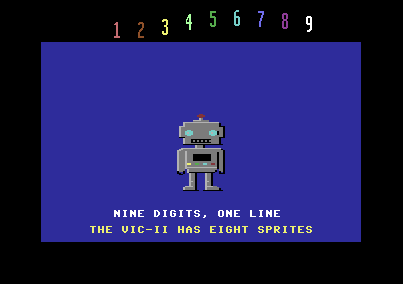
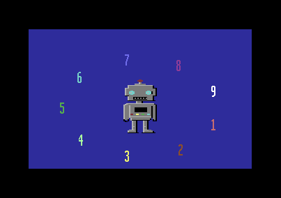

# ROBO NINE

A Commodore 64 intro in 6502 assembler, inspired by
[Nine](https://www.linusakesson.net/scene/nine/index.php) by Linus Åkesson
(lft, 2025): instead of a magician, a robot pulls nine digits out of its
chest. They circle around it, then line up in the top border: nine digits on
the same raster lines, although the VIC-II has only eight sprites. The code
and the trick are our own; only the idea comes from Nine.





## Running

```bash
cd demo/robo_nine
python3 gen_data.py                       # writes data.asm
64tass -C -o robo_nine.prg --labels=robo_nine.lbl robo_nine.asm
../../target/release/c64 robo_nine.prg
```

The emulator types `RUN` after boot. The PRG (7.4 KB, from `$0801`) also runs in
VICE (`x64sc -autostart robo_nine.prg`). At the end it goes back to the
`READY.` prompt with the program still in memory: `RUN` starts it again.

## The show

The music runs at 6 frames per sixteenth, so a bar is 96 frames.

| Bars | What happens |
|---|---|
| 0-1 | "SAMPOSOFT PRESENTS" |
| 2 | the robot appears; its eyes light up half a bar later |
| 3-11 | one digit per bar comes out of the chest hatch and joins the orbit |
| 12-15 | the nine digits circle around the robot |
| 16-24 | one digit per bar flies to its place in the top border |
| 25-32 | the row does a wave, with the captions below the robot |
| 33-41 | the digits go back to the orbit, 9 first |
| 46-50 | two digits per bar go back into the chest |
| 51 | the robot's eyes go off and the music fades out |
| 52 | back to BASIC |

The robot looks at the digit that is moving, blinks every 3 seconds, and its
chest lights and antenna bulb follow the drums.

## The ninth digit

Eight digits are sprites. The **7** is not: it is drawn with the idle byte.
With the upper and lower border open (`$D011` goes to 24 rows at line 249,
back to 25 after line 251), the VIC shows in the border the byte at `$3FFF`
of the bank: bits 1 are black, bits 0 have the background colour `$D021`.
`$3FFF` normally holds `$FF`, so the border stays black. On each of the 16
lines of the digit:

| Cycle | Write | Effect |
|---|---|---|
| 40 | `$3FFF` = glyph row, inverted | the byte fetched at cycle 41 (column 26) holds the row |
| 44 | `$D021` = black | the digit's colour covered that byte and 2 pixels of the next one |
| 48 | `$3FFF` = `$FF` | everything black again |
| 55 | `$D021` = digit colour | ready for the next line |

Two writes cannot be closer than 4 cycles, and the colour change reaches the
screen one cycle before the graphics fetched at the same time, so the colour
stays on for 8 + 2 pixels with the fine scroll at 7 (with scroll 1 it would
be 16). The digits are 6 pixels wide and the ghost one sits in bits 5-0 of its
byte: the two extra pixels fall on its empty columns. `$D016` goes to 38
columns during these lines, so the left border covers the 7 pixels the scroll
leaves free.

The writes must land on exact cycles, but the sprite DMA of each line changes
while the digits hop in the wave or fly in (0 to 19 stolen cycles, between
cycles 55 and 10). CIA1 timer A runs with a period of 63 cycles, started once
at a stable raster position (double interrupt): its value tells each line the
current cycle. Each line's block (unrolled 16 times):

1. reads `$DC04` in a 9-cycle loop until the value says cycle 11-19, when
   all sprite DMA of the line is over;
2. branches into a slide of `cmp #$c9`… `cmp $ea` / `nop` that waits 10-2
   cycles more, so it always reaches cycle 35;
3. does the four writes above. The last one lands on cycle 55, when the DMA
   of the next line may already have started (the CPU still completes up to
   3 writes), so after the DMA the block only has to read the timer again.

The 7 flies to the row as a sprite and becomes the idle byte on the frame it
arrives, at the same pixel, so nothing moves.

## Interrupts

KERNAL and BASIC are off (`$01 = $35`), the vectors are at `$FFFE`/`$FFFA`.

| Raster line | What it does |
|---|---|
| 249 | opens the border, turns the sprites off (a sprite with Y below 56 would show again 256 lines later), writes the sprites of the next frame, restores 25 rows after line 251, plays the music |
| 5 | turns the sprites on |
| row Y | the ghost digit's 16 lines, when the 7 sits in the row |
| top sprite Y + 22 | sprite 0 is reused for the ninth sprite digit (orbit, and whenever the 7 is a sprite) |

The main loop prepares each frame after the interrupt at line 249: script,
positions (orbit tables, easing with an 8x8 multiplication), robot
animation, insertion sort of the sprite digits by Y.

## Memory

| Address | Contents |
|---|---|
| `$0801` | BASIC stub `2026 SYS2061` |
| `$080D`-`$25xx` | code, player, data (the band blocks are aligned so that no branch crosses a page) |
| `$0400` | screen |
| `$3000`-`$37FF` | characters: `$00`-`$3F` copied from the ROM at start, `$40`-`$83` the robot |
| `$3800`-`$3A7F` | sprites: empty, then the digits 1-9 |
| `$3FFF` | the idle byte |

## Back to BASIC

The intro uses the zero page and turns the ROMs off, so at the start it
copies `$02`-`$FF` aside. At the end it stops the interrupts and the SID,
puts the zero page back (BASIC's program pointers are there), turns the ROMs
on and calls IOINIT (`$FDA3`: the CIAs and the KERNAL's timer interrupt, since
timer A of CIA1 was used for the raster sync) and CINT (`$FF81`: VIC and a
clear screen), then jumps through `$A002` to BASIC's warm start, which prints
`READY.`.

## Files

- `robo_nine.asm`: main source, commented. `SKIP` starts the show at a
  later bar with the digits already in the row (for testing).
- `player.asm`: the SID player of `demo/sid/game_tune`, with the drums
  setting `beat` instead of flashing the border.
- `gen_data.py`: digits, robot (multicolour characters drawn as text),
  orbit/easing/hop tables and the music "Nine Bolts" (A minor, 2 bars of
  intro then 16 looping bars: pulse lead, filtered bass with kick and snare,
  arpeggios). Writes `data.asm`.
- `data.asm`, `robo_nine.prg`, `robo_nine.lbl`: generated.
- `screenshot.png`, `orbit.png`: made with the emulator.
