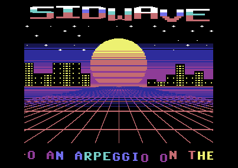
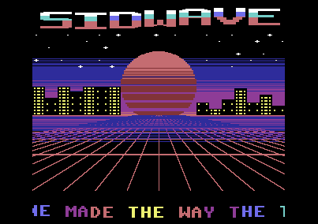

# SIDWAVE

A Commodore 64 demo in 6502 assembler built around an original SID tune,
"Neon Horizon", written with the techniques of the trackers and of the
1980s composers, and a synthwave sunset that follows it: a striped sun, a
city whose buildings are a spectrum analyser of the three voices, a grid
running towards the horizon, the logo in the upper border and a scroller in
the lower one.





## Running

```bash
cd demo/sidwave
python3 music.py                          # music.asm
python3 gfx.py                            # gfx_*.asm (numpy; --preview writes build/preview.png)
64tass -C -o sidwave.prg --labels=sidwave.lbl sidwave.asm
../../target/release/c64 sidwave.prg
```

The emulator types `RUN` after boot. The PRG (30 KB, from `$0801`) also
runs in VICE (`x64sc -autostartprgmode 1 -autostart sidwave.prg`). SPACE
goes back to BASIC. `tune.prg` (from `tune.asm`) is the tune alone.

The tune lasts 2'26" and then starts again; so does the show.

## The music

The tune is in A minor at 125 BPM (6 frames per sixteenth) and has the
shape of a pop song:

| Bars | Section | What happens |
|---|---|---|
| 1-8 | intro | a pad through a resonant low-pass filter that opens over 8 bars; from bar 5 kick on the beats and bass on the off-beats; a snare roll into the verse |
| 9-24 | verse | pulse lead; bass on the eighths with octave jumps, kick on 1 and 3; gated chords with the hi-hats on the off-beats and the snare on 2 and 4 |
| 25-40 | chorus | sawtooth lead an octave up; rolling sixteenth bass; brighter chords (major sevenths, minor ninths) |
| 41-48 | break | no drums, a slow band-pass/low-pass sweep over long bass notes, a soft triangle lead echoed by the third voice |
| 49-52 | build | four-on-the-floor kick, a snare roll that gets denser, a whole tone up |
| 53-68 | chorus | in B minor |
| 69-76 | outro | the pad closes again and the volume fades out |

Three voices for bass, drums, chords and lead: the parts share the voices.
Voice 1 plays bass and kick, voice 2 the lead (and the snare fills in the
intro), voice 3 the chords with the hi-hats and the snare inside them.

### Techniques

Collected from the trackers' documentation and from composers' notes (see
[Sources](#sources)) and all used in the tune:

- **Hard restart.** The SID's envelope has a counter that is not reset
  between phases: a new note can start its attack up to 33 ms late (the
  "ADSR bug"). Two frames before every new note the player turns the gate
  off and sets ADSR to `$0000`, so the counter starts again from zero and
  every attack is on time. Legato notes (portamento) skip it.
- **Wave tables.** Every instrument runs a table, one row per frame, of
  waveform and note (relative or absolute). This is how the drums live
  inside the other parts: the kick is a frame of noise and a pulse falling
  from C3 to G1 in four frames, then the same instrument goes on as a
  sawtooth bass note; the snare is noise, a low pulse "body", noise again,
  then a chord; a hi-hat is one frame of high noise before a chord.
- **50 Hz arpeggios** for the chords: one note per frame, so a single voice
  sounds like a chord (Martin Galway's trick). Nine shapes: minor, major,
  their inversions, sevenths, a minor ninth.
- **The test bit** on the first frame of the gated chords: the oscillator
  restarts from zero, the attack is the same every time.
- **Pulse width sweeps**: slow on the lead (`$300`-`$620` and back), wider
  and shared by the chords (`$200`-`$800`): the pulse programme is not
  restarted by every chord, so the timbre keeps moving across notes.
- **A filter envelope on every bass note**: each note restarts a filter
  programme that opens the low-pass and closes it in a quarter of a second,
  with resonance (a "pluck"). In the intro the filter is on the pad instead
  and opens over eight bars; in the break a band-pass and low-pass sweep
  goes up and down over the bass for eight bars.
- **Delayed vibrato**: it starts 16 frames into the note, so short notes
  stay in tune and only long ones sing.
- **An octave "blip"** on the first frame of each lead note (a common
  colour of SID leads).
- **Echo with a voice**: in the break the third voice repeats the lead
  three sixteenths later, softer.
- **Portamento** into the last note of the build.
- **A key change** for the last chorus, through the order lists'
  transposition: the same patterns a whole tone up.
- **Arrangement**: every part has its own register (bass E1-E3, chords
  E3-B4, lead F4-G6), the melody uses a recurring rhythmic cell
  (3+3+2 sixteenths) in the chorus, and the verse ends on E major to push
  into the chorus.

### The player

`player.asm` (1.5 KB of code, 0.5 KB of variables) is written for this demo, in the style of the
modern trackers. Per voice, every frame: automatic gate off, wave table,
pitch as note plus portamento plus vibrato in sixteenths of a semitone
(interpolated on the frequency table), pulse programme; then the global
filter programme and the volume fade. Patterns are packed (instrument,
duration and commands as prefixes, only when they change), the order lists
transpose. The formats are in `music.py`.

The player reads the next row before the row starts, so that it can do
the hard restart: voice 1 on the row's frame 1, voice 2 on frame 2, voice 3
on frame 3, never all three on the same frame. A frame costs 800-2200
cycles (median 1100).

## The picture

The sky and the ground are made of characters (the sky in multicolour, the
ground in hires, with two character sets); almost all the colour comes from
registers changed on every raster line.

| Lines | Contents | How |
|---|---|---|
| 0-50 | logo | the upper border is open; seven multicolour sprites, X-expanded, in chrome bands (white, cyan, pink); the letters wave and the one of each lead note jumps |
| 51-154 | sky, sun, city | `$d021` (sky gradient) and `$d023` (the sun's colour) change on every line; the sun's stripes are lines where `$d023` takes the sky colour; stars and windows are `$d022`, buildings colour RAM |
| 155-250 | grid | the lines towards the vanishing point are characters; the horizontal lines are `$d021` on the lines where they fall, moving at the speed of the section |
| 262-282 | scroller | the lower border is open; eight X-expanded sprites move left 2 pixels per frame, in a wave and a rainbow |

### The kernel

From line 51 to 192 a cycle-exact kernel, generated by `gfx.py`, writes the
colours of each line in the cycles that are not drawn: cycle 62 of the
previous line, 3 and 7 of the line itself. Then it loads the values for the
next line and waits for cycle 59. On a bad line the VIC takes cycles 12-54
from the CPU: the loads must be done by cycle 11, then a NOP stalls until
55. The generator simulates every block's cycles and checks the write
positions. It is entered from a double interrupt at line 46/47 that removes
the jitter.

Below line 192 the horizontal grid lines are at most two, so the kernel
stops and interrupts draw them: each event (a line's colour on, back to
black, the 24 rows that open the borders, 25 rows again) waits for its line
and then for its last cycles reading CIA1's timer A, which runs with a
period of 63 cycles, one line, and is restarted on a fixed cycle every
frame. This frees about 3000 cycles a frame for the rest.

### The city

Fourteen buildings, two characters wide, on both sides of the sun. Their
height is a spectrum analyser: each voice's frequency (its high byte
through a table, 4 semitones per building) raises a building and, less, its
neighbours; a new note goes near the top, a held one stays lower, the
buildings fall 2 pixels per frame down to their height at rest. The drums
(frames of noise) raise their own building: the kick the first, the snare
the middle, the hi-hats the last. Each building's column of characters for
each height comes from a table, and only half of the buildings are redrawn
per frame.

### The show

The tune sends a sync value at every section, and the picture follows it:
the sun rises through four colour ramps in the intro and sets in the outro;
the grid runs slowly in the intro and the break, faster in the verse,
faster still in the choruses, accelerates in the build and stops in the
outro; in the choruses the grid flashes on every kick.

## Frame and memory

| Raster line | What happens |
|---|---|
| 46 | interrupt: stabilizes the raster, restarts CIA1's timer, kernel down to line 192 |
| 192 | the main loop prepares the next frame (scroller, logo, grid, sun, buildings, stars) while the interrupts come |
| 193-253 | the events: near grid lines, `$d011` to 24 rows on line 248, back to 25 on line 252 |
| 253 | scroller sprites, then the music |
| 295 | logo sprites and the registers for the sky |

The KERNAL and BASIC are off (`$01 = $35`), the VIC is in bank 1.

| Address | Contents |
|---|---|
| `$0801` | BASIC stub, code, player, kernel, building drawing |
| `$2800` | the kernel's colour tables (per line) |
| `$4000` | screen |
| `$4400` | sprites: logo letters, then the scroller's eight |
| `$4800` | sky characters (56) |
| `$5000` | ground characters (234) |
| `$5800` | the ROM's upper case font, copied at start, for the scroller |
| `$5A00` | the tune and the tables |
| `$7FFF` | 0: the idle byte, so that the open borders show `$d021` |

At the end (SPACE) the demo restores the zero page, turns the ROMs on,
calls IOINIT and CINT and goes back to BASIC.

## Files

- `music.py`: instruments, wave/pulse/filter tables and the tune; writes
  `music.asm`.
- `player.asm`: the player.
- `gfx.py`: character sets, screen, colour RAM, logo sprites, tables, the
  kernel and the building drawing; writes `gfx_*.asm`.
- `sidwave.asm`: the demo. `tune.asm`: the tune alone.
- `music.asm`, `gfx_*.asm`, `sidwave.prg`, `sidwave.lbl`, `tune.prg`:
  generated.

## Sources

The techniques of the tune come from:

- [Sound design hints & tips](https://csdb.dk/forums/index.php?roomid=14&topicid=97576&showallposts=1),
  CSDb forum: drum recipes (waveforms and pitches per frame), pulse sweeps,
  vibrato delay, kick and bass on one voice.
- [SID-Article](https://github.com/ImreOlajos/SID-Article/blob/main/SID-Article.md)
  by Imre Olajos: hard restart and the ADSR bug, the test bit, filter use,
  arpeggios.
- [GoatTracker's readme](http://phd-sid.ethz.ch/debian/goattracker/goattracker/readme.txt)
  by Lasse Öörni: wave, pulse and filter tables, hard restart timing.
- [C64 Music for Dummies](https://chipmusic.org/forums/topic/8104/c64-music-for-dummies-c64-tutorial/),
  chipmusic.org: instrument recipes.

The picture takes the usual elements of the synthwave style (a striped sun,
a neon grid, a city at dusk, a chrome logo) without copying any image; the
analyser city, the code and the tune are our own.
